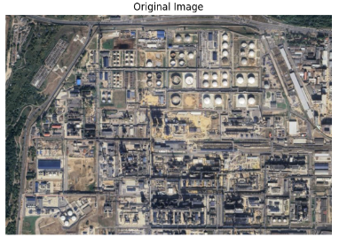
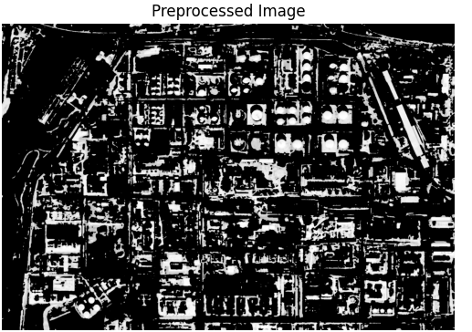
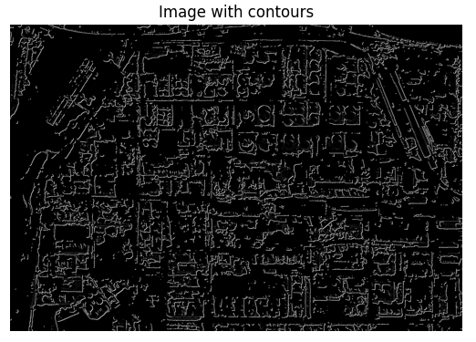
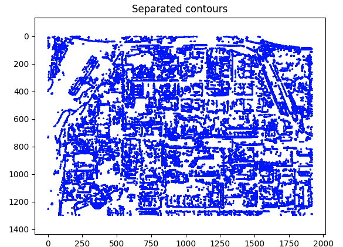
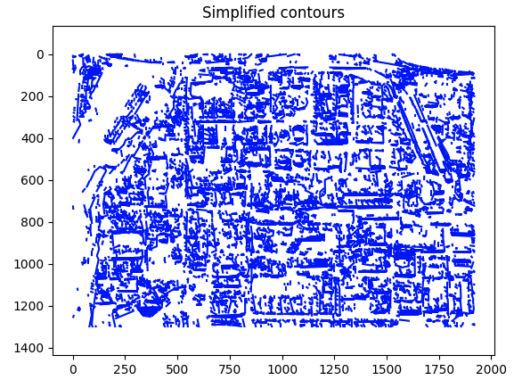

# Satellite Image Contouring

An image processing pipeline that detects and simplifies contours in satellite imagery. The pipeline preprocesses the input image (grayscale conversion, Gaussian blur, CLAHE contrast enhancement, shadow removal), detects edges using a manually implemented Prewitt operator, groups connected pixels into separate contours, and then simplifies them using the Douglas-Peucker algorithm — also implemented from scratch rather than relying on OpenCV's built-in version.

The project was built as part of a computer vision course, with the goal of understanding how contour detection works under the hood rather than just calling library functions.

## How it works

The input image goes through several stages. First, it gets converted to grayscale and denoised with a Gaussian blur. Then CLAHE is applied to improve local contrast, and a simple threshold-based shadow mask removes dark regions that would otherwise produce false edges.

Edge detection is done with the Prewitt operator — two 3x3 convolution kernels (horizontal and vertical) are applied to the image, and the gradient magnitude is computed from both directions. The resulting edge map is binarized and passed through scipy's connected component labeling to extract individual contours.

Finally, each contour is simplified using a recursive Douglas-Peucker implementation that reduces the number of points while preserving the overall shape. The epsilon parameter controls how aggressively points are removed.

## Requirements

```
pip install -r requirements.txt
```

OpenCV, NumPy, SciPy, Matplotlib.

## Usage

Place your image in the `photos/` directory and update the filename in `main.py`:

```bash
python main.py
```

The script displays the original image, the preprocessed version, detected edges, raw contours, and simplified contours.

## Example workflow










